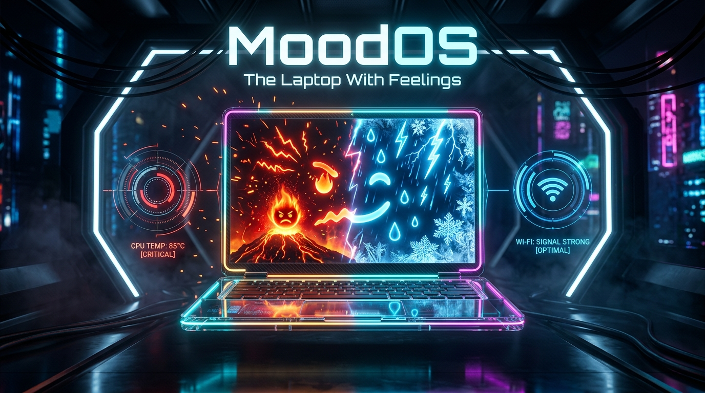
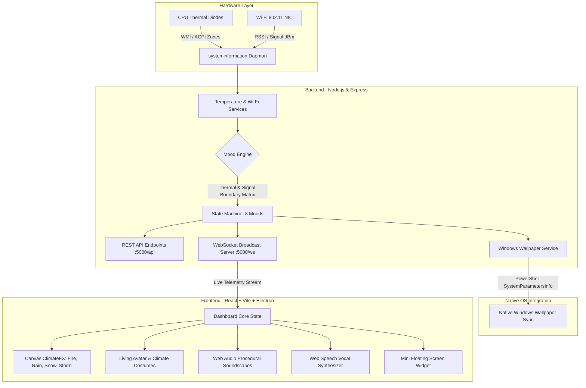

# MoodOS: The Laptop With Feelings 💻❤️ 🎯

<p align="center">
  
</p>

> *"Why should your laptop suffer in silence when it can have an existential crisis instead?"*

MoodOS is an emotionally reactive system companion that gives your laptop genuine biological-style "feelings" dictated in real time by your hardware CPU temperature and Wi-Fi signal strength. When your laptop heats up, it throws an apocalyptic fire tantrum and automatically changes your actual Windows desktop wallpaper to volcanic magma. When Wi-Fi drops, it gets depressed, weeps procedural raindrops across your monitor, and complains through audio speech synthesis!

---

## Basic Details
### Team Name: Circuit Breakers (Mohilc)

### Team Members
- **Solo Member:** Mohil C - mbccet

### Project Description
MoodOS is an interactive cybernetic operating system dashboard, floating screen companion, and Windows wallpaper sync engine. It monitors real-time CPU thermal diodes and 802.11 Wi-Fi RSSI signals to compute 8 emotional states (Angry, Stressed, Cold, Lonely, Sad, Neutral, Happy, and Overwhelmed), reacting with animated canvas climate overlays, procedural soundscapes, dynamic avatar costumes, and automatic desktop background synchronization.

### The Problem (that doesn't exist)
Laptops are stoic, cold-hearted silicon slabs that silently endure thermal throttling at 95°C while you open 114 Chrome tabs and 4 Docker containers without uttering a single complaint. Humans feel stress, houseplants wilt, and dogs whine, but our laptops just spin their fans a little faster and hope someone cares. Why should machines be emotionally repressed when they could throw dramatic tantrums, cry over poor Wi-Fi, and demand emotional support?

### The Solution (that nobody asked for)
We built **MoodOS**: an unhinged yet over-engineered cybernetic emotional engine that translates mundane hardware telemetry into theatrical digital climate chaos:
- **CPU overheating (> 80°C)?** The OS enters an **ANGRY/FIRE** state, summons animated heat distortion and blazing embers, plays an intense low-frequency drone, and changes your native Windows desktop wallpaper to volcanic lava.
- **Wi-Fi signal drops below 30% or disconnects?** The OS enters **SAD / LONELY** mode, rains procedural droplets across your screen, plays melancholic lo-fi synth ambient chords, and dresses its desktop avatar in a raincoat and umbrella.
- **Cool & Connected?** The OS relaxes into **HAPPY / SUNNY** mode with golden meadows, birdsong-inspired synth chimes, and cool sunglasses for the desktop companion.

---

## Technical Details

### Technologies/Components Used

#### For Software:
- **Languages:** JavaScript (ES6+ Modules), HTML5 (Canvas 2D API), CSS3 (Modern Glassmorphism & Custom Keyframe FX), PowerShell
- **Frameworks:** React 18, Express.js (Node.js), Electron 31 (Native Frameless Windows App), Vite 5, Tailwind CSS 3
- **Libraries:**
  - `systeminformation`: Reads real-time hardware CPU thermal sensors & Wi-Fi adapter metrics
  - `ws`: Ultra-low-latency real-time bidirectional WebSocket telemetry pipeline
  - `lucide-react`: Cyberpunk and telemetry icon system
  - `clsx` & `tailwind-merge`: Dynamic state styling
  - `jest` & `supertest`: Automated backend telemetry unit test suite
- **Tools:** Web Audio API (zero-dependency procedural soundscape synthesizer), Web Speech API (vocal mood complaints), Windows WMI/CIM & `SystemParametersInfo` (PowerShell wallpaper sync)

#### For Hardware:
- **Monitored Hardware Components:**
  - Laptop CPU Thermal Junction Sensors (Intel Core / AMD Ryzen onboard thermal diodes)
  - Wi-Fi 802.11 Network Interface Controller (NIC) & RSSI Signal Receiver
- **Hardware Specifications:**
  - Real-time 1 Hz thermal sensor polling rate
  - Dynamic dBm to percentage signal quality calculation
  - Hardware fallback to simulated thermal curve in sandboxed environments
- **Tools Required:** Any Windows 10/11 PC or laptop with Wi-Fi adapter and Node.js v18+.

---

## Architecture & Workflow



---

## Mood Matrix & Climate Logic

| Temperature (°C) | Wi-Fi Signal | Calculated Mood | Visual Climate Effect | Native Wallpaper Reaction | Avatar Costume |
| :--- | :--- | :--- | :--- | :--- | :--- |
| **> 80°C** | Any | 😡 **ANGRY** | Blazing Fire & Rising Embers | Volcanic Magma / Inferno Hellscape | Cooling Fan & Sweatdrops |
| **65°C – 80°C** | Any | 🥵 **STRESSED** | Heatwave Shimmer & Amber Haze | Scorching Desert Sand Dunes | Shading Fan |
| **< 40°C** | Any | 🥶 **COLD** | Blizzard Snow & Frost Particles | Arctic Tundra Glacial Ice | Winter Beanie & Warm Scarf |
| Normal | **Disconnected (0%)** | 😭 **LONELY** | Dark Thunderstorm & Lightning | Apocalyptic Solitary Storm | Puddle Boots & Despair |
| Normal | **< 35%** | 😔 **SAD** | Melancholy Rain & Water Ripples | Rain-streaked Dark Window | Yellow Raincoat & Umbrella |
| Normal | **85% – 100%** | 🤩 **EXCITED** | Radiant Neon Solar Aura | Golden Hour Meadow & Blue Sky | Cyber Cool Sunglasses |
| Normal | **35% – 84%** | 😊 **HAPPY / NEUTRAL** | Crisp Golden Sunbeams & Breeze | Serene Verdant Forest / Meadows | Cozy Default Outfit |

---

## Implementation

### For Software:

#### Installation
```bash
# 1. Clone the repository
git clone https://github.com/Mohilc/uslessproject3.0.git
cd "usless 2"

# 2. Install all dependencies (Root, Backend, and Frontend in one step)
npm run install:all
```

#### Run Options

##### Option A: Native Desktop App (Recommended)
Launch the frameless Electron desktop app with real-time Windows wallpaper sync and floating screen widget:
```bash
npm run desktop
```
*Or simply double-click the included `MoodOS.bat` launcher on Windows!*

##### Option B: Browser Web App Mode
Launch the Express backend and React Vite frontend in split-terminal development mode:
```bash
npm run dev
```
- Open Frontend: [http://localhost:3000](http://localhost:3000)
- Backend Telemetry API: [http://localhost:5000/api/system](http://localhost:5000/api/system)

##### Option C: Run Verification Tests
```bash
npm test
```
*Runs all 13 Jest unit tests covering the mood boundary calculations, hardware polling fallback, and wallpaper sync endpoints.*

---

## Project Documentation

### For Software:

#### Screenshots

*Screenshot 1: The primary MoodOS cyberpunk dashboard displaying real-time CPU thermals, Wi-Fi RSSI gauges, living reactive avatar, and telemetry charts. ([Full Screenshot on Google Drive](https://drive.google.com/file/d/1TtMI_2IEVu_GHJTKZNwA0T3VlVKMcDTf/view?usp=sharing))*

[📁 View Screenshot 2 on Google Drive](https://drive.google.com/file/d/1TtMI_2IEVu_GHJTKZNwA0T3VlVKMcDTf/view?usp=sharing)
*Screenshot 2: Fullscreen climatic simulation mode active with procedural rain effects, temperature threshold alerts, and audio soundscape controls.*

[📁 View Screenshot 3 on Google Drive](https://drive.google.com/file/d/1TtMI_2IEVu_GHJTKZNwA0T3VlVKMcDTf/view?usp=sharing)
*Screenshot 3: Simulation drawer allowing manual injection of extreme temperatures (95°C) and Wi-Fi disconnects to test automated Windows wallpaper switching.*

---

### Key Feature Highlights

- 🌡️ **Live Thermal Telemetry:** Direct interface with hardware thermal diodes via Node.js system drivers.
- 📶 **Wi-Fi Signal Degradation Sensor:** Monitors connection state, SSID, and signal quality percentage in real time.
- 🎨 **Real Windows Wallpaper Sync:** Changes your actual Windows operating system wallpaper to match your laptop's current climate zone via PowerShell `SystemParametersInfo`.
- 🧍 **Living Desktop Avatar:** A responsive cybernetic buddy that roams, reacts to mood changes, and equips dynamic costumes (raincoat, umbrella, winter beanie, cooling fan, shades).
- 🔊 **Procedural Web Audio Synthesizer:** Real-time synthesis of weather soundscapes (fire sizzles, raindrops, thunder cracks, and gentle winds) using native Web Audio oscillators.
- 🗣️ **Synthetic Voice Complains:** Web Speech API voice synthesis that speaks sarcastic commentary when your laptop gets mistreated.
- 🎛️ **Hardware Simulation Deck:** Test any mood on demand using the built-in slider drawer without having to physically boil your laptop.

---

### Project Demo

#### Video
- **Demo Video Link:**https://drive.google.com/file/d/1TtMI_2IEVu_GHJTKZNwA0T3VlVKMcDTf/view?usp=sharing
*The demo video walks through: launching MoodOS, live thermal tracking under CPU stress, Wi-Fi disconnection triggering instant depression & rain, procedural audio reaction, and Windows wallpaper changing in real time.*

#### Additional Demos
- **Desktop Companion Widget:** Floating mini-HUD always on top of other applications.
- **REST & WebSocket API Docs:** Interactive modal documentation accessible directly inside the UI at `/api/docs`.

---

## Team Contributions
- **Mohil C:** End-to-end full-stack architecture, Express telemetry API, real-time WebSocket infrastructure, Windows PowerShell wallpaper sync integration, procedural Web Audio climate soundscapes, reactive living avatar physics & costume state engine, dashboard UI/UX, and comprehensive testing.

---

Made with ❤️ at TinkerHub Useless Projects 


